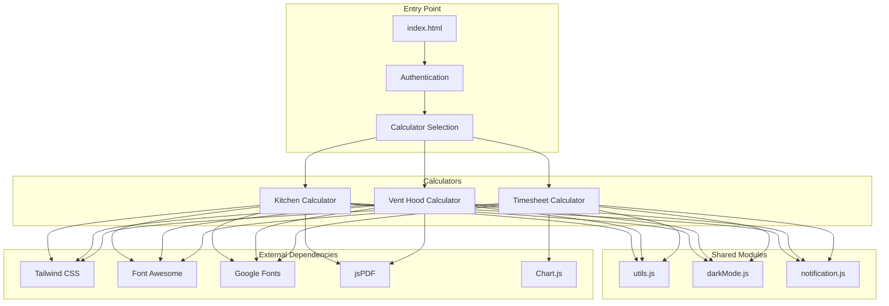

# Architecture Documentation - Janitorial Cleaning Calculator Suite

## System Architecture Overview



## Design Principles

### 1. Modularity
- **Independent Calculators**: Each calculator operates independently with its own state and logic
- **Shared Components**: Common functionality extracted into reusable modules
- **Loose Coupling**: Calculators don't directly depend on each other

### 2. Progressive Enhancement
- **Core Functionality First**: Basic calculations work without external dependencies
- **Enhanced Features**: Advanced features (PDF, charts) loaded on-demand
- **Graceful Degradation**: Application remains functional if CDNs fail

### 3. State-Centric Design
- **Single Source of Truth**: Each calculator maintains a centralized state object
- **Immutable Updates**: State changes create new snapshots for history
- **Reactive UI**: UI automatically updates when state changes

### 4. Performance First
- **Debounced Updates**: Calculations throttled to prevent excessive processing
- **Lazy Loading**: Heavy libraries loaded only when needed
- **Efficient Rendering**: Minimal DOM manipulation

## Component Architecture

### Authentication Layer

```
┌─────────────────────────────────────────┐
│           index.html                     │
├─────────────────────────────────────────┤
│  ┌─────────────────────────────────┐    │
│  │    Password Authentication      │    │
│  │  ┌─────────────────────────┐   │    │
│  │  │   Input Validation       │   │    │
│  │  │   Session Management     │   │    │
│  │  │   24-hour Persistence   │   │    │
│  │  └─────────────────────────┘   │    │
│  └─────────────────────────────────┘    │
│                                          │
│  ┌─────────────────────────────────┐    │
│  │    Calculator Selection         │    │
│  │  ┌──────┐ ┌──────┐ ┌──────┐   │    │
│  │  │Kitchen│ │ Vent │ │ Time │   │    │
│  │  │      │ │ Hood │ │sheet │   │    │
│  │  └──────┘ └──────┘ └──────┘   │    │
│  └─────────────────────────────────┘    │
└─────────────────────────────────────────┘
```

### Calculator Architecture

Each calculator follows this structure:

```
┌─────────────────────────────────────────┐
│          Calculator Instance             │
├─────────────────────────────────────────┤
│  ┌─────────────────────────────────┐    │
│  │         State Object            │    │
│  │  ┌─────────────────────────┐   │    │
│  │  │    Core Data            │   │    │
│  │  │    Configuration        │   │    │
│  │  │    Options              │   │    │
│  │  │    UI State             │   │    │
│  │  │    Results Cache        │   │    │
│  │  │    History              │   │    │
│  │  └─────────────────────────┘   │    │
│  └─────────────────────────────────┘    │
│                                          │
│  ┌─────────────────────────────────┐    │
│  │      Business Logic Layer       │    │
│  │  ┌─────────────────────────┐   │    │
│  │  │   Calculation Engine    │   │    │
│  │  │   Validation Rules      │   │    │
│  │  │   Data Transformers     │   │    │
│  │  └─────────────────────────┘   │    │
│  └─────────────────────────────────┘    │
│                                          │
│  ┌─────────────────────────────────┐    │
│  │    Presentation Layer           │    │
│  │  ┌─────────────────────────┐   │    │
│  │  │   UI Components         │   │    │
│  │  │   Event Handlers        │   │    │
│  │  │   DOM Manipulation      │   │    │
│  │  └─────────────────────────┘   │    │
│  └─────────────────────────────────┘    │
└─────────────────────────────────────────┘
```

## Data Flow Architecture

### Input → State → Calculation → Output

```
User Input
    ↓
Event Handler (debounced)
    ↓
Validation
    ↓
State Update
    ↓
Save Snapshot (history)
    ↓
Calculate All
    ↓
Update Results
    ↓
Update UI
    ↓
Highlight Changes
    ↓
Save to LocalStorage
```

### State Management Flow

```
┌─────────────┐     ┌─────────────┐     ┌─────────────┐
│   Current   │────►│   History   │────►│   Storage   │
│    State    │     │  Snapshots  │     │ (LocalStore)│
└─────────────┘     └─────────────┘     └─────────────┘
       ↑                    │                    │
       │                    │                    │
       └────────────────────┴────────────────────┘
                     Restore/Load
```

## Module Architecture

### Shared Modules Dependency Graph

```
┌─────────────────────────────────────────┐
│              utils.js                    │
│  Core utility functions that don't      │
│  depend on any other modules            │
└─────────────────────────────────────────┘
                    ↑
     ┌──────────────┴──────────────┐
     │                             │
┌────┴──────────┐         ┌───────┴────────┐
│ darkMode.js   │         │notification.js │
│ Uses: utils   │         │ Uses: utils    │
└───────────────┘         └────────────────┘
```

### Calculator Module Dependencies

```
Calculator (app.js)
    ├── utils.js
    │   ├── formatCurrency()
    │   ├── debounce()
    │   ├── $()
    │   └── ...
    ├── darkMode.js
    │   └── darkModeManager instance
    └── notification.js
        └── notificationManager instance
```

## Event Architecture

### Event Flow Diagram

```
┌─────────────────┐
│   DOM Events    │
│  (input, click) │
└────────┬────────┘
         │
         ▼
┌─────────────────┐
│ Event Listeners │
│   (delegated)   │
└────────┬────────┘
         │
         ▼
┌─────────────────┐
│    Handlers     │
│   (debounced)   │
└────────┬────────┘
         │
         ▼
┌─────────────────┐
│ State Updates   │
└────────┬────────┘
         │
         ▼
┌─────────────────┐
│ Custom Events   │
│  (dispatched)   │
└─────────────────┘
```

### Event Types

1. **User Events**
   - Input changes
   - Button clicks
   - Checkbox toggles
   - Tab switches

2. **System Events**
   - State changes
   - Calculation complete
   - PDF generated
   - Theme changed

3. **Lifecycle Events**
   - DOM ready
   - Module loaded
   - Calculator initialized
   - Storage synchronized

## Security Architecture

### Client-Side Security Model

```
┌─────────────────────────────────────────┐
│          Security Layers                 │
├─────────────────────────────────────────┤
│  1. Authentication (Password)            │
│     └── Client-side validation          │
│                                          │
│  2. Session Management                   │
│     └── 24-hour localStorage token      │
│                                          │
│  3. Input Validation                     │
│     ├── Type checking                   │
│     ├── Range validation                │
│     └── Sanitization                    │
│                                          │
│  4. Output Encoding                      │
│     └── XSS prevention                  │
└─────────────────────────────────────────┘
```

### Security Considerations

1. **No Sensitive Data Storage**
   - Calculations are business logic only
   - No personal information stored
   - No payment processing

2. **Input Validation**
   - All numeric inputs validated
   - Range constraints enforced
   - No SQL injection risk (no database)

3. **XSS Prevention**
   - No user-generated HTML
   - textContent used instead of innerHTML
   - PDF content sanitized

## Performance Architecture

### Optimization Strategies

```
┌─────────────────────────────────────────┐
│       Performance Optimizations          │
├─────────────────────────────────────────┤
│  1. Debouncing                          │
│     └── 300ms delay on calculations     │
│                                          │
│  2. Caching                             │
│     ├── DOM element references          │
│     └── Calculation results             │
│                                          │
│  3. Lazy Loading                        │
│     ├── Chart.js (timesheet only)      │
│     └── jsPDF (on-demand)              │
│                                          │
│  4. Efficient Updates                   │
│     ├── Batch DOM changes               │
│     └── RequestAnimationFrame          │
└─────────────────────────────────────────┘
```

### Memory Management

```
State History (Limited)
    ├── Max 20 snapshots
    ├── Circular buffer
    └── Automatic cleanup

Event Listeners
    ├── Delegated where possible
    ├── Cleanup on navigation
    └── WeakMap for references

Temporary Data
    ├── Calculation intermediates
    ├── UI state
    └── Garbage collected
```

## Scalability Considerations

### Horizontal Scaling (New Calculators)

To add a new calculator:

```
1. Create new directory
   └── /new-calculator
       ├── index.html
       ├── app.js
       └── styles.css

2. Follow state structure
   └── const state = {
         core: {},
         config: {},
         options: {},
         ui: {},
         results: {}
       }

3. Import shared modules
   └── <script src="../shared/utils.js"></script>

4. Add to navigation
   └── Update all navigation menus
```

### Vertical Scaling (Features)

```
Feature Addition Pattern:
1. Extend state object
2. Add UI components
3. Update calculation logic
4. Maintain backward compatibility
5. Update documentation
```

## Testing Architecture

### Test Strategy

```
┌─────────────────────────────────────────┐
│           Test Levels                    │
├─────────────────────────────────────────┤
│  1. Unit Tests (Functions)              │
│     └── Test calculation accuracy       │
│                                          │
│  2. Integration Tests (Modules)         │
│     └── Test module interactions       │
│                                          │
│  3. UI Tests (Manual)                   │
│     └── Test user workflows            │
│                                          │
│  4. Performance Tests                   │
│     └── Test calculation speed         │
└─────────────────────────────────────────┘
```

### Test File Structure

```
test-shared-modules.html
    └── Tests all shared utilities

test-calculator-functions.html
    └── Tests calculation logic

test-pdf-client-info.html
    └── Tests PDF generation

test-work-order.html
    └── Tests work order features
```

## Deployment Architecture

### Static Deployment Model

```
┌─────────────────────────────────────────┐
│         Deployment Options               │
├─────────────────────────────────────────┤
│  CDN Edge Network                        │
│  ┌─────────────────────────────────┐    │
│  │   Static Files Distribution     │    │
│  │   ├── HTML                      │    │
│  │   ├── JavaScript                │    │
│  │   └── CSS                       │    │
│  └─────────────────────────────────┘    │
│                                          │
│  External Dependencies (CDN)             │
│  ┌─────────────────────────────────┐    │
│  │   ├── Tailwind CSS              │    │
│  │   ├── Font Awesome              │    │
│  │   ├── Google Fonts              │    │
│  │   └── Libraries (jsPDF, etc)    │    │
│  └─────────────────────────────────┘    │
└─────────────────────────────────────────┘
```

### Zero-Backend Architecture Benefits

1. **No Server Maintenance**
   - No database to manage
   - No API servers
   - No authentication servers

2. **Instant Deployment**
   - Push to repository
   - Automatic CDN distribution
   - No build process

3. **Infinite Scalability**
   - CDN handles traffic
   - No server bottlenecks
   - Global distribution

4. **Cost Effective**
   - Free hosting options
   - No server costs
   - Minimal bandwidth usage

## Future Architecture Considerations

### Potential Enhancements

1. **Backend Integration**
   ```
   API Gateway
       ├── Authentication Service
       ├── Quote Storage Service
       ├── Client Management
       └── Analytics Service
   ```

2. **Microservices Architecture**
   ```
   Calculator Service
       ├── Calculation Engine API
       ├── PDF Generation Service
       ├── Notification Service
       └── Storage Service
   ```

3. **Progressive Web App**
   ```
   PWA Features
       ├── Service Worker
       ├── Offline Support
       ├── Push Notifications
       └── App Installation
   ```

### Migration Path

1. **Phase 1**: Current (Client-Only)
2. **Phase 2**: Add Optional Backend
3. **Phase 3**: Full Stack Application
4. **Phase 4**: Microservices

---

*This architecture documentation provides a comprehensive overview of the system design, patterns, and principles used in the Janitorial Cleaning Calculator Suite.*